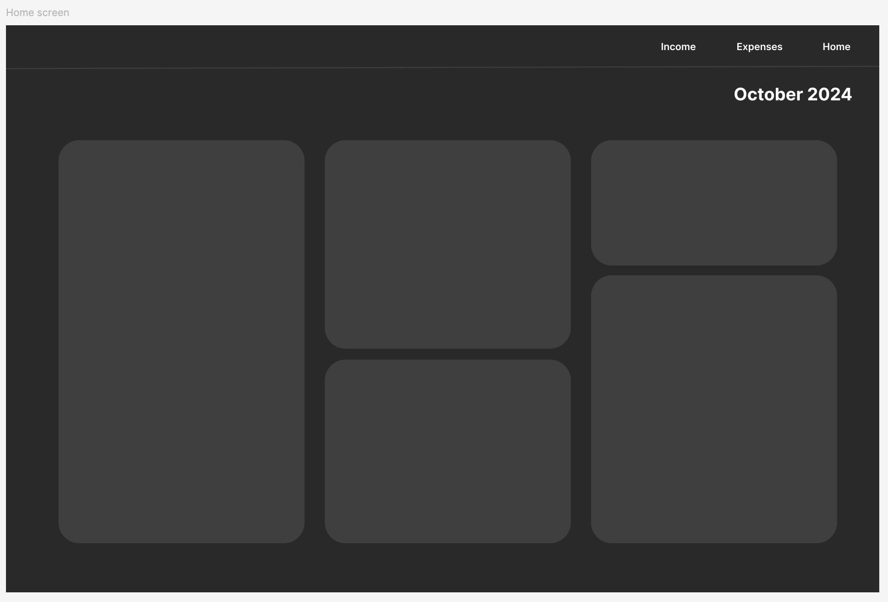
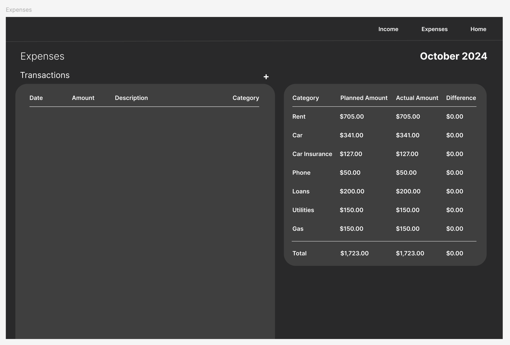
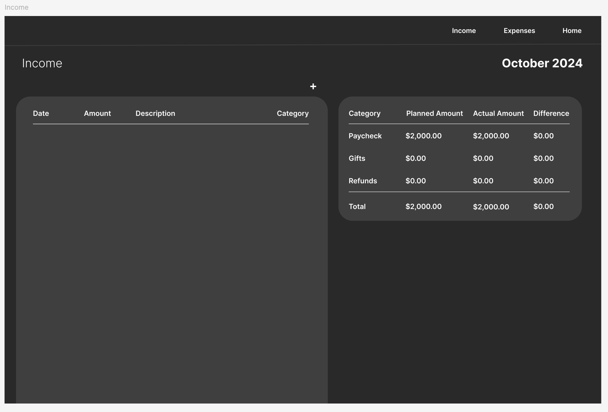
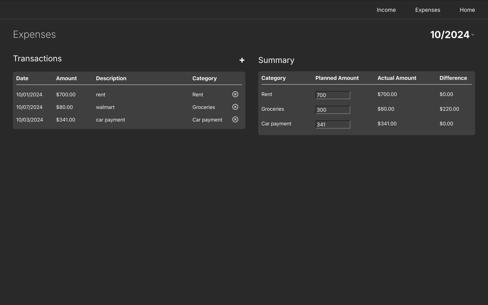
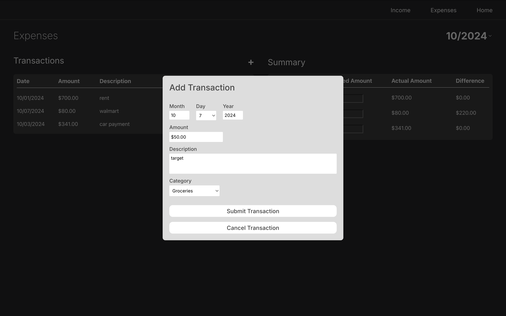

# Budget Tracker

## Description
Tracks monthly expenses, including individual transactions, planned amount to spend for individual categories, and income on monthly basis. 

## Project Status
This project is currently in development. Users can view the Expenses page, and load, edit, and save their monthly transactions. They can also load, edit, and save the price amount the user plans to spend for a particular category per month. The Home and Income page are in progress.

## Project Screen Shots

### Figma Designs

Home Page  

Expenses Page  

Income Page  

### Implementation

Expenses Page  

Adding new transaction  

## Tech Stack

Designs
- Figma

Frontend
- JavaScript / TypeScript
- React

Backend
- Node.js
- Express

Database
- MongoDB
- Mongoose

## Reflection

In this project, I wanted to focus on working with Node.js and Express, as I had no previous experience with these frameworks. This project has been a great learning experience so far, as I was able to move through parts of the entire application development process, starting with creating simple Figma designs and implementing a functional frontend. Then, moving towards building the backend and integrating a working database. 
